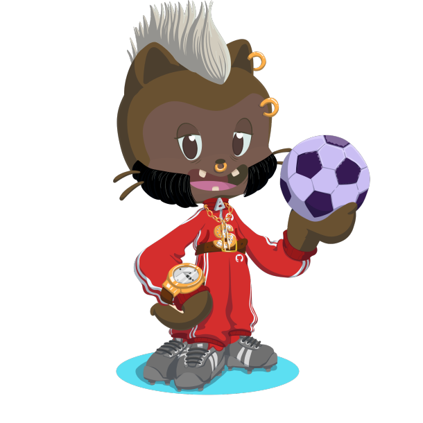

<h1 align="center"></h1>

<h1 align="center">Hola , Soy Benjamín Ramos</h1>
<h3 align="center">Estudiante de 1º DAM en el IES Luis Vives</h3>

<h3 align="left">Sobre Mí:</h3>
Actualmente , soy estudiante de primero en el ciclo de grado superior de DAM, en el centro IES Luis Vives de Leganés. Estoy interesado en el mundo de los videojuegos y en la programación. Estoy estudiando DAM para descubrir más y más del mundo de la informática y a su vez aprender desarrollo de aplicaciones multiplataforma, web y móviles.

- 💻 Estudiante en: **[IESLuisVives](https://www.iesluisvives.es/)**

- 📫 Contáctame: **benjaramossmr@gmail.com**

- ⚡ Status: **Aprendiendo Kotlin 😄.**

<h3 align="left">Languages and Tools:</h3>

    

<h3 align="left">Redes:</h3>

  

